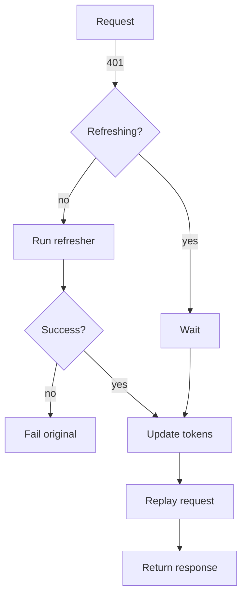

# dio_toolkit

**Languages:** [English](#english) · [Русский](#russian)

<p align="left">
  <a href="https://pub.dev/packages/dio_toolkit">
    
  </a>
  <a href="https://pub.dev/packages/dio_toolkit/score">
    
  </a>
  <a href="https://github.com/ZoomerDeveloper/dio_toolkit">
    
  </a>
</p>

---

<a id="english"></a>

## English

A pragmatic, type-safe HTTP client **on top of Dio** with batteries included:

- **Typed results**: `Result<T>` with `Success/Failure` and a unified `ApiException` hierarchy.
- **Auth header**: automatic Bearer token via `AuthInterceptor`.
- **Token refresh queue**: single-flight refresh on `401` with automatic retry.
- **Retries**: configurable retry for transient errors (timeouts, 502/503/504) with exponential backoff.
- **In-memory cache**: per-request cache with TTL (`CacheOptions`).
- **Lightweight logging**: easy to plug, easy to disable in release.

> Built for teams that prefer a tiny, testable layer instead of a giant networking framework.

### Table of contents
- [Features](#features)
- [Install](#install)
- [Quick start](#quick-start)
- [Decoding](#decoding)
- [Error handling](#error-handling)
- [Auth & Refresh flow](#auth--refresh-flow)
- [Caching](#caching)
- [Retries](#retries)
- [Configuration](#configuration)
- [Examples](#examples)
- [FAQ](#faq)
- [Roadmap](#roadmap)
- [Contributing](#contributing)
- [License](#license)

### Features
- `DioToolkitClient` wrapper around Dio with sensible defaults.
- Interceptors:
  - `AuthInterceptor` — attaches `Authorization: Bearer <token>` from your provider.
  - `RefreshInterceptor` — queues parallel requests, performs a single refresh on 401, retries once with fresh token.
  - `RetryInterceptor` — retries network timeouts and 502/503/504 with exponential backoff.
  - `CacheInterceptor` — simple in-memory cache per GET with TTL.
  - `LoggingInterceptor` — minimal, stdout-based (disable in release builds).
- `Result<T>` & `ApiException` — one error surface for UI/domain layers.
- Cancelation support via `CancelToken`.

> No magic codegen required. Bring your own models and `json_serializable` as usual.

### Install
Add to your `pubspec.yaml`:
```yaml
dependencies:
  dio_toolkit: ^0.1.0
```
Also add Dio if not already present:
```yaml
dependencies:
  dio: ^5.6.0
```

### Quick start
Create the client once (e.g., in your DI container):
```dart
import 'package:dio_toolkit/dio_toolkit.dart';

final client = DioToolkitClient.withDefaults(
  baseUrl: 'https://api.example.com',
  tokenProvider: () async => accessToken, // get from secure storage
  tokenRefresher: () async {
    // Call your backend to refresh tokens
    final tokens = await refreshTokens();
    return RefreshTokens(accessToken: tokens.access, refreshToken: tokens.refresh);
  },
  onTokensUpdated: (t) {
    accessToken = t.accessToken; // persist as needed
    refreshToken = t.refreshToken;
  },
  isRefreshRequest: (req) => req.path.contains('/auth/refresh'),
  cacheStore: CacheStore(),
  enableLogging: false, // true for debug
);
```
Call an endpoint:
```dart
// Model
class User {
  final int id; final String name;
  User({required this.id, required this.name});
  factory User.fromJson(Map<String, dynamic> j) => User(id: j['id'] as int, name: j['name'] as String);
}

Future<void> loadUsers() async {
  final res = await client.get<List<User>>(
    '/users',
    decoder: (raw) => (raw as List)
        .cast<Map<String, dynamic>>()
        .map(User.fromJson)
        .toList(),
  );

  res.when(
    success: (users) => print('Loaded: ${users.length}'),
    failure: (e) => print('Error: ${e.message}'),
  );
}
```

### Decoding
`DioToolkitClient.request<T>` accepts an optional `decoder<T>` to convert raw Dio data (`Object?`) into your model. Bring your own `json_serializable` or manual factories.

Examples:
```dart
// Single object
final me = await client.get<User>(
  '/me',
  decoder: (d) => User.fromJson(d as Map<String, dynamic>),
);

// List of objects
final list = await client.get<List<User>>(
  '/users',
  decoder: (d) => (d as List)
      .cast<Map<String, dynamic>>()
      .map(User.fromJson)
      .toList(),
);

// Envelope { data, meta }
final res = await client.get<Envelope<List<User>>>(
  '/users',
  decoder: (raw) => Envelope.list(raw, (j) => User.fromJson(j)),
);
```
> Tip: for `204 No Content` or empty bodies, make your decoder null-safe (return empty list/object as appropriate).

### Error handling
All failures are captured as `ApiException`:
```dart
final res = await client.get<User>('/me', decoder: ...);
res.when(
  success: (u) => ...,
  failure: (e) {
    switch (e) {
      case _Unauthorized(): // 401
        // navigate to login or trigger refresh logic in app layer
        break;
      case _Network():
      case _Timeout():
        // show retry snackbar
        break;
      default:
        // generic dialog
    }
  },
);
```
Exception types include: `network`, `timeout`, `badRequest(400)`, `unauthorized(401)`, `forbidden(403)`, `notFound(404)`, `conflict(409)`, `server(5xx)`, `cancelled`, `unknown`.

### Auth & Refresh flow
- `AuthInterceptor` asks your `TokenProvider` before each request and sets `Authorization` header.
- On `401`, `RefreshInterceptor`:
  1. If a refresh is already in progress, **queues** the request until it completes.
  2. Otherwise triggers your `TokenRefresher` once (single-flight),
  3. Calls `onTokensUpdated`,
  4. Replays the failed request **once** with the new token.


> Protect `isRefreshRequest` so the interceptor does not try to refresh the refresh-call itself.

### Caching
Enable caching per request using `CacheOptions`:
```dart
final res = await client.get<List<User>>(
  '/users',
  extra: CacheOptions(maxAge: Duration(seconds: 60)).toExtra(),
  decoder: ...,
);
```
- Cache is **in-memory** and opt-in.
- Works for `GET` only.
- Use `forceRefresh: true` to bypass cache explicitly.

### Retries
`RetryInterceptor` retries transient failures:
- Network timeouts (`connectionTimeout`, `sendTimeout`, `receiveTimeout`)
- `502`, `503`, `504`

Configuration (via `withDefaults`):
```dart
maxRetries: 2,
initialBackoff: Duration(milliseconds: 300),
```
Backoff is exponential: 300ms, 600ms, 1200ms, ...

### Configuration
`DioToolkitClient.withDefaults` parameters:
```dart
DioToolkitClient.withDefaults({
  required String baseUrl,
  Duration connectTimeout = const Duration(seconds: 10),
  Duration sendTimeout = const Duration(seconds: 15),
  Duration receiveTimeout = const Duration(seconds: 15),
  TokenProvider? tokenProvider,
  TokenRefresher? tokenRefresher,
  void Function(RefreshTokens tokens)? onTokensUpdated,
  bool Function(RequestOptions req)? isRefreshRequest,
  bool enableLogging = true,
  int maxRetries = 2,
  Duration initialBackoff = const Duration(milliseconds: 300),
  CacheStore? cacheStore,
  List<Interceptor> extraInterceptors = const [],
  void Function(RequestOptions options)? onBeforeRequest,
});
```

### Examples
A minimal runnable example is under [`example/`](example/). Run:
```bash
dart run example/main.dart
```

### FAQ
**Why not retrofit/chopper?**  
They are great! `dio_toolkit` targets teams that prefer a small, explicit wrapper with zero codegen, easy testing, and a single error surface.

**How do I cancel a request?**  
Pass a `CancelToken` and call `cancelToken.cancel()`, typical Dio usage.

**Is logging safe for production?**  
Disable logging in release. If you need redaction, replace `LoggingInterceptor` with your own (drop-in via `extraInterceptors`).

**Does cache survive app restarts?**  
No. It's in-memory by design. A persistent cache is on the roadmap.

### Roadmap
- Respect `Retry-After` header.
- In-flight GET deduplication (coalescing).
- Persistent disk cache (ETag/Last-Modified).
- Rate limiting / circuit breaker helpers.
- Optional auto-decoders for `json_serializable` projects.

### Contributing
PRs welcome! Please:
1. Write unit tests when changing behavior.
2. Run format and analyzer.
3. Update `CHANGELOG.md`.
```bash
dart format .
dart analyze
```

### License
MIT © ZoomerDeveloper

---

<a id="russian"></a>

## Русский

Прагматичная, типобезопасная HTTP-библиотека **поверх Dio** — со всем необходимым из коробки:

- **Типобезопасные результаты**: `Result<T>` с `Success/Failure` и единой иерархией ошибок `ApiException`.
- **Авторизация**: автоматическое добавление Bearer-токена через `AuthInterceptor`.
- **Очередь рефреша**: при `401` выполняется единичный рефреш токена и автоматический повтор запроса.
- **Повторы (retry)**: на временные ошибки (таймауты, 502/503/504) с экспоненциальной задержкой.
- **Кэш в памяти**: включается на уровне запроса с TTL (`CacheOptions`).
- **Лёгкие логи**: просто подключить, просто отключить в релизе.

> Подходит командам, которым нужен небольшой, тестопригодный слой вместо громоздкого сетевого фреймворка.

### Содержание
- [Возможности](#возможности)
- [Установка](#установка)
- [Быстрый старт](#быстрый-старт)
- [Декодирование](#декодирование)
- [Обработка ошибок](#обработка-ошибок)
- [Авторизация и рефреш](#авторизация-и-рефреш)
- [Кэширование](#кэширование)
- [Повторы](#повторы)
- [Конфигурация](#конфигурация)
- [Примеры](#примеры)
- [FAQ](#faq-ru)
- [Дорожная карта](#дорожная-карта)
- [Вклад](#вклад)
- [Лицензия](#лицензия)

### Возможности
- Обёртка `DioToolkitClient` с адекватными настройками по умолчанию.
- Интерсепторы:
  - `AuthInterceptor` — проставляет заголовок `Authorization: Bearer <token>`.
  - `RefreshInterceptor` — при `401` ставит параллельные запросы в очередь, выполняет один рефреш, повторяет исходный запрос один раз.
  - `RetryInterceptor` — повторяет при сетевых таймаутах и `502/503/504`.
  - `CacheInterceptor` — простой in-memory кэш для `GET` c TTL.
  - `LoggingInterceptor` — минимальные логи (stdout), отключаемые в релизе.
- `Result<T>` и `ApiException` — единая поверхность ошибок для UI/доменных слоёв.
- Поддержка отмены запросов через `CancelToken`.

> Никакого «магического» кодогенератора. Модели подключаются как обычно (`json_serializable`/ручные фабрики).

### Установка
Добавьте в `pubspec.yaml`:
```yaml
dependencies:
  dio_toolkit: ^0.1.0
```
Также убедитесь, что Dio подключён:
```yaml
dependencies:
  dio: ^5.6.0
```

### Быстрый старт
Создайте клиент один раз (например, в DI-контейнере):
```dart
import 'package:dio_toolkit/dio_toolkit.dart';

final client = DioToolkitClient.withDefaults(
  baseUrl: 'https://api.example.com',
  tokenProvider: () async => accessToken, // получите из secure storage
  tokenRefresher: () async {
    // вызовите ваш backend для обновления токенов
    final tokens = await refreshTokens();
    return RefreshTokens(accessToken: tokens.access, refreshToken: tokens.refresh);
  },
  onTokensUpdated: (t) {
    accessToken = t.accessToken;
    refreshToken = t.refreshToken;
  },
  isRefreshRequest: (req) => req.path.contains('/auth/refresh'),
  cacheStore: CacheStore(),
  enableLogging: false, // включайте в debug
);
```
Вызов эндпоинта:
```dart
class User {
  final int id; final String name;
  User({required this.id, required this.name});
  factory User.fromJson(Map<String, dynamic> j) => User(id: j['id'] as int, name: j['name'] as String);
}

Future<void> loadUsers() async {
  final res = await client.get<List<User>>(
    '/users',
    decoder: (raw) => (raw as List)
        .cast<Map<String, dynamic>>()
        .map(User.fromJson)
        .toList(),
  );

  res.when(
    success: (users) => print('Загружено: ${users.length}'),
    failure: (e) => print('Ошибка: ${e.message}'),
  );
}
```

### Декодирование
`DioToolkitClient.request<T>` принимает необязательный `decoder<T>`, который преобразует «сырые» данные Dio (`Object?`) в вашу модель. Используйте `json_serializable` или ручные `fromJson`.

Примеры:
```dart
// Один объект
final me = await client.get<User>(
  '/me',
  decoder: (d) => User.fromJson(d as Map<String, dynamic>),
);

// Список объектов
final list = await client.get<List<User>>(
  '/users',
  decoder: (d) => (d as List)
      .cast<Map<String, dynamic>>()
      .map(User.fromJson)
      .toList(),
);

// Обёртка { data, meta }
final res = await client.get<Envelope<List<User>>>(
  '/users',
  decoder: (raw) => Envelope.list(raw, (j) => User.fromJson(j)),
);
```
> Совет: для `204 No Content` или пустых тел делайте декодер «безопасным к null» (возвращайте пустой список/объект по месту).

### Обработка ошибок
Все ошибки сводятся к `ApiException`:
```dart
final res = await client.get<User>('/me', decoder: ...);
res.when(
  success: (u) => ...,
  failure: (e) {
    switch (e) {
      case _Unauthorized(): // 401
        // перейти на логин или инициировать логику обновления в приложении
        break;
      case _Network():
      case _Timeout():
        // показать баннер «повторить»
        break;
      default:
        // общий диалог
    }
  },
);
```
Типы включают: `network`, `timeout`, `badRequest(400)`, `unauthorized(401)`, `forbidden(403)`, `notFound(404)`, `conflict(409)`, `server(5xx)`, `cancelled`, `unknown`.

### Авторизация и рефреш
- `AuthInterceptor` перед каждым запросом спрашивает `TokenProvider` и ставит заголовок `Authorization`.
- При `401` `RefreshInterceptor`:
  1. Если рефреш уже выполняется — **ставит запрос в очередь**.
  2. Иначе запускает ваш `TokenRefresher` (single-flight),
  3. Вызывает `onTokensUpdated`,
  4. Повторяет исходный запрос **один раз** с новым токеном.

> Не забудьте настроить `isRefreshRequest`, чтобы интерсептор не пытался «рефрешить» сам рефреш-запрос.

### Кэширование
Включайте кэширование на уровне запроса через `CacheOptions`:
```dart
final res = await client.get<List<User>>(
  '/users',
  extra: CacheOptions(maxAge: Duration(seconds: 60)).toExtra(),
  decoder: ...,
);
```
- Кэш **в памяти**, по умолчанию выключен.
- Работает только для `GET`.
- Используйте `forceRefresh: true`, чтобы намеренно обойти кэш.

### Повторы
`RetryInterceptor` повторяет запросы при временных сбоях:
- Сетевые таймауты (`connectionTimeout`, `sendTimeout`, `receiveTimeout`)
- `502`, `503`, `504`

Настройка (через `withDefaults`):
```dart
maxRetries: 2,
initialBackoff: Duration(milliseconds: 300),
```
Экспонента: 300мс, 600мс, 1200мс, ...

### Конфигурация
Параметры `DioToolkitClient.withDefaults`:
```dart
DioToolkitClient.withDefaults({
  required String baseUrl,
  Duration connectTimeout = const Duration(seconds: 10),
  Duration sendTimeout = const Duration(seconds: 15),
  Duration receiveTimeout = const Duration(seconds: 15),
  TokenProvider? tokenProvider,
  TokenRefresher? tokenRefresher,
  void Function(RefreshTokens tokens)? onTokensUpdated,
  bool Function(RequestOptions req)? isRefreshRequest,
  bool enableLogging = true,
  int maxRetries = 2,
  Duration initialBackoff = const Duration(milliseconds: 300),
  CacheStore? cacheStore,
  List<Interceptor> extraInterceptors = const [],
  void Function(RequestOptions options)? onBeforeRequest,
});
```

### Примеры
Мини-пример лежит в [`example/`](example/). Запуск:
```bash
dart run example/main.dart
```

### FAQ (RU)
**Почему не retrofit/chopper?**  
Эти решения отличные. `dio_toolkit` — для тех, кто хочет небольшой явный слой без кодогенерации, с простой поддержкой тестов и единой моделью ошибок.

**Как отменять запросы?**  
Передавайте `CancelToken` и вызывайте `cancelToken.cancel()` — стандартный механизм Dio.

**Безопасно ли логирование в проде?**  
В релизе отключайте. Если нужен редакт/маскирование — подмените `LoggingInterceptor` своим через `extraInterceptors`.

**Переживает ли кэш перезапуск приложения?**  
Нет. Это in-memory по дизайну. Персистентный кэш — в планах.

### Дорожная карта
- Учитывать заголовок `Retry-After`.
- Дедупликация параллельных GET (coalescing).
- Персистентный диск-кэш (ETag/Last-Modified).
- Rate limiting / circuit breaker.
- Опциональные авто-декодеры для проектов на `json_serializable`.

### Вклад
PR приветствуются! Пожалуйста:
1. Пишите тесты к поведенческим изменениям.
2. Запускайте форматтер и анализатор.
3. Обновляйте `CHANGELOG.md`.
```bash
dart format .
dart analyze
```

### Лицензия
MIT © ZoomerDeveloper

